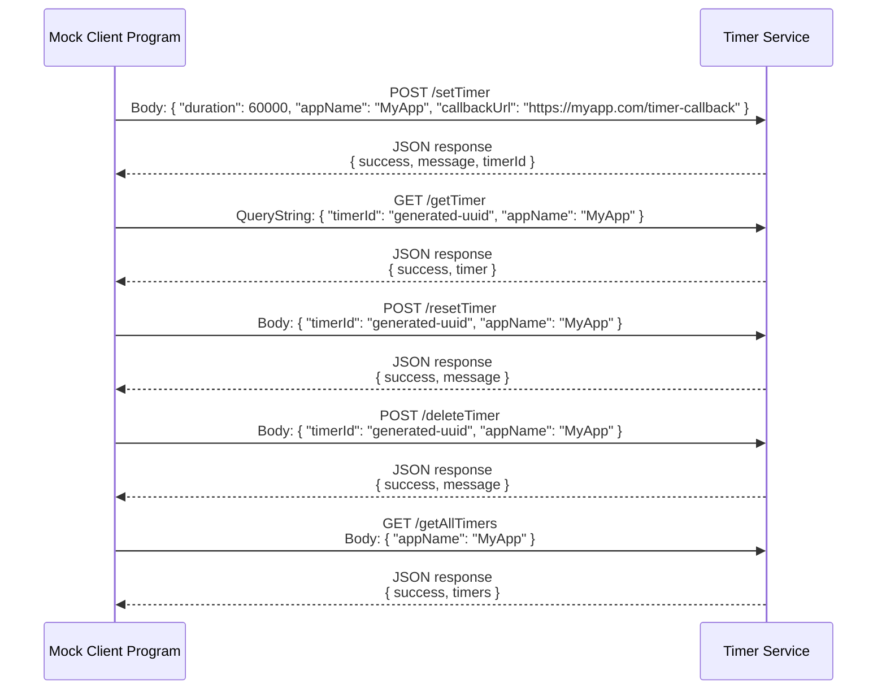

# Timer Service

`Service Owner:` **Emily Soh**\
`Contributing Developer:` **Taurean Newsome**

---

# Description

A lightweight REST Microservice that provides Timer Management Functionality for client applications. The service suppports creating, retrieving, and resetting timers through simple HTTP endpoints. It is designed to be easily integrated into various applications that require scheduled intervals or countdowns.

---

# Communication Contract

## Requesting Data

### Get Timer

Returns Current Timer Information.

#### Endpoint

```http
GET /getTimer
```

#### Example Request

```js
fetch('https://timer.api.osu-allsystemsgo.com/getTimer', {
  method: 'GET',
  params: JSON.stringify({
    timerId: '12345',
    appName: 'MyApp',
  }),
})
  .then((response) => response.json())
  .then((data) => console.log(data));
```

---

```http
GET /getAllTimers
```

#### Example Request

```js
fetch('https://timer.api.osu-allsystemsgo.com/getAllTimers', {
  method: 'GET',
  params: JSON.stringify({
    appName: 'MyApp',
  }),
})
  .then((response) => response.json())
  .then((data) => console.log(data));
```

---

### Set Timer

Sets a New Timer Duration.

#### Endpoint

```http
POST /setTimer
```

#### Example Request

```js
fetch('https://timer.api.osu-allsystemsgo.com/setTimer', {
  method: 'POST',
  body: JSON.stringify({
    duration: 10000, // Duration in milliseconds
    appName: 'MyApp',
    callbackUrl: 'https://myapp.com/timer-callback', // URL to call when timer expires
  }),
})
  .then((response) => response.json())
  .then((data) => console.log(data));
```

---

### Reset Timer

Resets Timer to original Duration.

#### Endpoint

```http
POST /resetTimer
```

#### Example Request

```js
fetch('https://timer.api.osu-allsystemsgo.com/resetTimer', {
  method: 'POST',
  body: JSON.stringify({
    timerId: '12345',
    appName: 'MyApp',
  }),
})
  .then((response) => response.json())
  .then((data) => console.log(data));
```

---

### Delete Timer

Delete Timer by timer id.

#### Endpoint

```http
POST /deleteTimer
```

#### Example Request

```js
fetch('https://timer.api.osu-allsystemsgo.com/deleteTimer', {
  method: 'POST',
  body: JSON.stringify({
    timerId: '12345',
    appName: 'MyApp',
  }),
})
  .then((response) => response.json())
  .then((data) => console.log(data));
```

---

## Receiving Data

All Endpoints return JSON.

---

#### Example Response

```json
{
  "success": true,
  "timer": {
    "timerId": "uuid-generated-id",
    "appName": "MyApp",
    "duration": 1000,
    "createdAt": "2026-05-13T00:00:00.000Z",
    "expiresAt": "2026-05-13T00:00:00.000Z",
    "lastUpdated": "2026-05-13T00:00:00.000Z"
  }
}
```

---

# Sequence Diagram



---

# User Stories

## Set Timer

> As a Client Application, I want to send a `setTimer` Request to the Timer Service,  
> So that my Application can Initialize & Track a Scheduled Interval Countdown.

### Functional Requirement

Given Timer? Service is running,\
When POST Request is sent to `setTimer` Endpoint with valid `seconds` Value,\
Then Microservice create or update current Timer State.

### Non-Functional Requirement & Quality Attribute

**Reliability**

When a valid `setTimer` Request is submitted,\
Service must consistently update Timer Data without losing the State Information.

---

## Get Timer

> As a Client Application, I want to `getTimer` (Retrieve current Timer Information) from the Timer Service,  
> So that my Application can Display current Timer State to Users.

### Functional Requirement

Given Timer? Service is running + Active Timer exists, \
When GET Request is sent to `getTimer` Endpoint,\
Then Microservice should return current Timer Information as JSON.

### Non-Functional Requirement & Quality Attribute

**Performance**

When a valid `getTimer` Request is sent,\
Service should return Timer Data quickly enough for Requesting Application to update Display without Noticeable Delay.

---

## Reset Timer

> As a Client Application, I want to `resetTimer` (Reset an Active/the Current Timer),  
> So that my Application Reset to the origianl duration starting now (server time).

### Functional Requirement

Given an Active Timer exists, \
When POST Request is sent to `resetTimer` Endpoint,\
Then Microservice should Restore Timer to it original Duration & update its Running State.

### Non-Functional Requirement & Quality Attribute

**Data Integrity**

When a valid `resetTimer` Request is submitted,\
Service must Preserve accurate Timer Duration Data while Resetting Timer State correctly.

---
